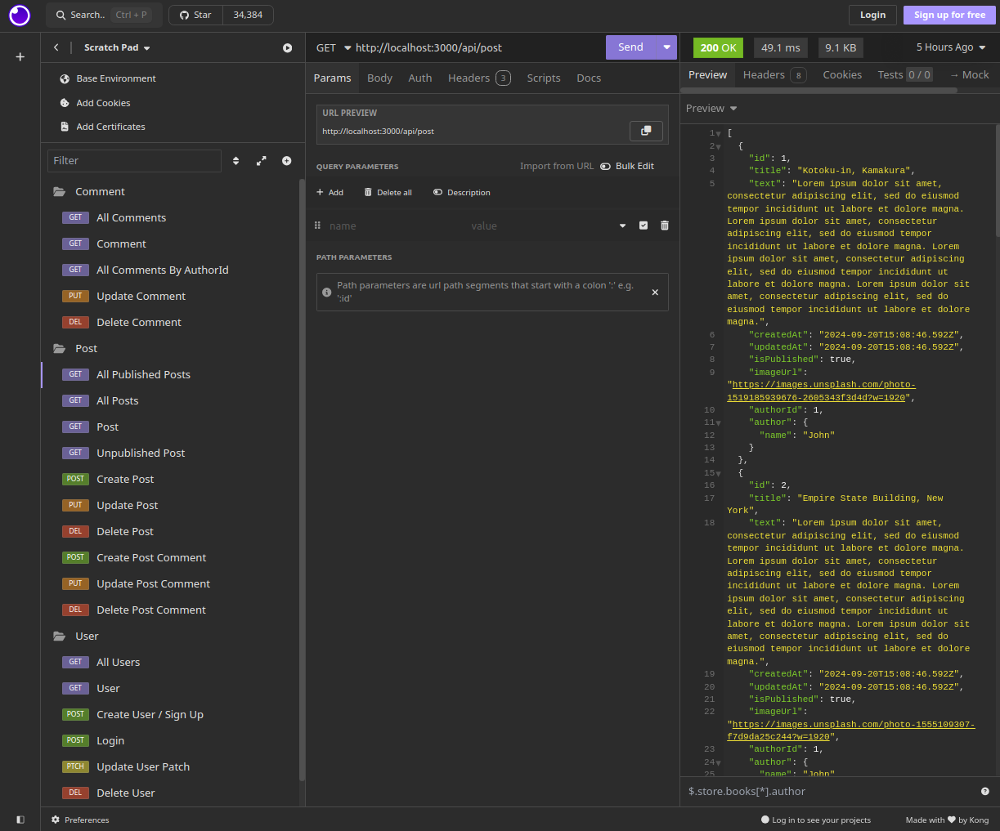

# Odin Project #26: Blog API (backend)

The goal of this Odin Project assignment was to create a full-stack blog application. The backend is a RESTful API that was built with tools like Express, Prisma (with PostgreSQL), Passport and JWT for authentication. It has 22 endpoints for managing users, posts and comments via CRUD operations. They can be accessed by a guest, user or admin (depending on user permissions). The font-end was built with React and can be found in [this repo](https://github.com/brightneon7631/odin-blog-api-frontend).

I started and finished this project in September 2024.

## Assignment

[The Odin Project - NodeJS - #26 Blog API](https://www.theodinproject.com/lessons/node-path-nodejs-blog-api)

## Technology

- JavaScript
- Express
- Express validator
- Passport (with passport-jwt strategy)
- Jsonwebtoken
- Prisma (PostgreSQL as db)
- Bcrypt
- Node.js

#### Additional NPM packages:

- Express async handler
- CORS
- dotenv

## Key Concepts

- REST API: JSON, HTTP Methods, CORS
- Prisma: ORM, connecting to a PostreSQL db, Prisma Schema, data models, Prisma Client, database migrations, CRUD, queries, relations
- JSON Web Tokens: token authentication vs session based authentication, authorization header; jsonwebtoken library: signing & verifying tokens, token expiration; passport & passport-jwt strategy: verifyCallback function, jwt payload object, passport.authenticate middleware
- Express: setting up an app, middleware functions
- Routes: Express Router, HTTP verbs, paths
- Controllers: response methods, middleware, CRUD operations in the database
- Express validator: form data validation: body() function & validationResult
- Error handling: error middleware function, custom errors; express-async-handler: catching thrown errors
- bcrypt: bcrypt.hash: hashing passwords, bcrypt.compare(): compares plain-text password to the hashed password

## Data Model

The Prisma data model has three tables: Users, Posts and Comments. Admin can access and manage everything. Users can access published posts, comments and create & manage their own comments. Guests can access published posts and comments and create a new account (or log in to an existing one).

The Comment model is linked to the Post and User models through a reference to the their ids. The Post model is also linked to the User model. Thanks to this comments are associated with posts and authors. Likewise posts are associated with their authors. Deleting a post will delete all its comments and deleting a user will also delete all their posts and comments.

## Authentication & Authorization

After creating a new account or logging into an existing one user will receive a JWT token. For protected routes, JWT token received with the Authorization header is validated to determine whether the user has access to the endpoint and its data.

## API Documentation

### User Endpoints

| Endpoint            | Method | Description                       | Access           |
| :------------------ | :----- | :-------------------------------- | :--------------- |
| /api/user           | GET    | Fetch all users                   | Admin            |
| /api/user/:id       | GET    | Fetch a single user               | Admin, Same user |
| /api/user/:id       | PATCH  | Update a user                     | Admin, Same user |
| /api/user/:id       | DELETE | Delete a user                     | Admin, Same user |
| /api/user/:id/admin | PATCH  | Update an admin                   | Admin            |
| /api/user/signup    | POST   | Create a user and get a jwt token | All              |
| /api/user/login     | POST   | Log in and get a jwt token        | All              |

### Post Endpoints

| Endpoint                             | Method | Description                                     | Access           |
| :----------------------------------- | :----- | :---------------------------------------------- | :--------------- |
| /api/post                            | GET    | Fetch all published posts (including comments)  | All              |
| /api/post                            | POST   | Create a post                                   | Admin            |
| /api/post/all                        | GET    | Fetch all posts (inluding unpublished ones)     | Admin            |
| /api/post/:id                        | GET    | Fetch a single published post                   | All              |
| /api/post/:id/admin                  | GET    | Fetch a single post (inluding unpublished ones) | Admin            |
| /api/post/:id                        | PUT    | Update a post                                   | Admin            |
| /api/post/:id                        | DELETE | Delete a post                                   | Admin            |
| /api/post/:id/comment                | POST   | Add a comment to a post                         | Admin, User      |
| /api/post/:postid/comment/:commentid | PUT    | Update a comment                                | Admin, Same User |
| /api/post/:postid/comment/:commentid | DELETE | Delete a comment                                | Admin, Same User |

### Comment Endpoints

| Endpoint                      | Method | Description                     | Access           |
| :---------------------------- | :----- | :------------------------------ | :--------------- |
| /api/comment                  | GET    | Fetch all comments              | All              |
| /api/comment/:id              | GET    | Fetch a single comment          | All              |
| /api/comment/:id              | PUT    | Update a comment                | Admin, Same user |
| /api/comment/:id              | DELETE | Delete a comment                | Admin, Same user |
| /api/comment/author/:authorid | GET    | Fetch all comments by author id | All              |

### API Testing

To test the API you can use tools like Insomnia, Postman or curl. Here's an example of the GET /api/post endpoint.



## Links

[Front-end Repo](https://github.com/brightneon7631/odin-blog-api-frontend)

## Deployment

Requires setting up a PostreSQL database and adding its URL to the .env file. Instructions for Linux and macOS can be found [here on The Odin Project website](https://www.theodinproject.com/lessons/nodejs-installing-postgresql).

```bash
# clone repo
git clone https://github.com/BrightNeon7631/odin-blog-api-backend.git

# install project dependencies
npm install

# generate prisma client
npx prisma generate

# add default data to the db
npx prisma db seed

# start server
node app.js
```
